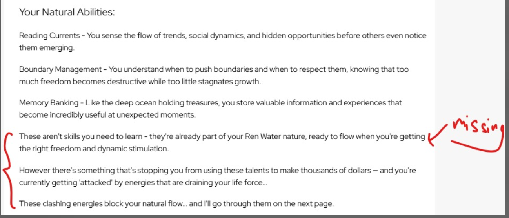

On the Day Master Reading Page,

1) Remove the Four Pillars table
2) Remove the sentence
3) Add in the missing sentence. And format all 3 sentences accordingly too. There should be a line break in between the sentences, not all in the same paragraph. Do a check for the remaining 9 Day Master Readings too
4) Remove the sentence

