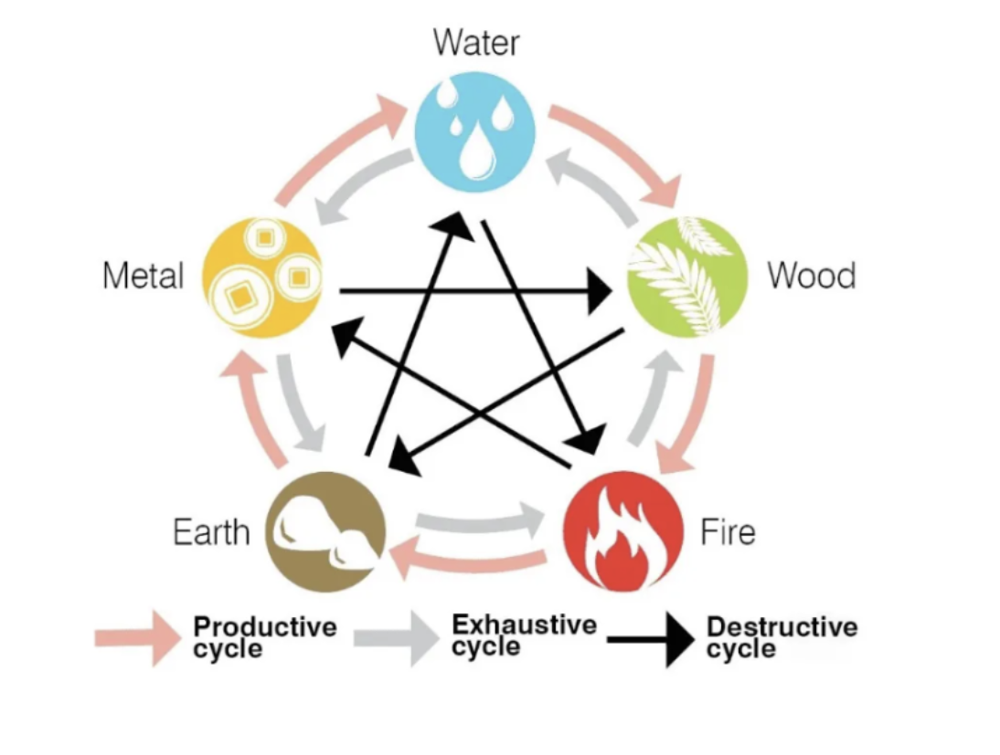

There are some frontend changes to add.

This will be a quiz funnel. The tabs for each quiz step can be found under “Document tabs”. You are to insert appropriate images for each page (do you need me to tell you exactly where to insert the images, or what images to insert?). Please also follow the bold and italic words, accurately.

Landing Page - This is where we collect the leads and their details. All fields are mandatory. There are a total of 3 different landing pages.
‘Country’ and ‘City’ fields should be a drop-down box.
Date of Birth to have 3 drop-down boxes in this sequence: Month, Day, Year
Birth Timing to be in 24H format.
After they opt-in, the lead should be zapped over to my Clickfunnels 2.0 account, and trigger a workflow automation.
For design wise, here’s a sample. Note that BaZi is closely related to the ancient Chinese art of Feng Shui, so your design should portray that.

Loading Page
Ignore the Document Tab, as we will collect all information in the Landing Page
This page will be used to ‘buy time’ while our backend retrieves their BaZi data. We will need to use the inputs to generate the person’s BaZi table and extract their Day Master.
All I need is a simple page that shows a progress bar loading, and a few texts below while we wait for the Day Master to be extracted:
Calculating %FIRSTNAME%’s “Life Energy Chart”...
Born on %MONTH-DAY-YEAR% at %BIRTH TIMING%...
Born in %BIRTH COUNTRY%, %BIRTH CITY%...
Finalizing last few details…

Reading Page
There will be 10 different reading pages due to 10 different Day Masters. Depending on the person’s Day Master, show them the relevant page. 
Sample of a reading page here

Closing Page
%DAY MASTER ATTACKING% elements -> Follow the Destructive Cycle for this. The element will be based on their Day Master.

This page will be shown in segments and pages. There will be a CTA button “[Dive Deeper Into My Reading & Tell Me More About The Adjustments!]” that the lead has to click to reveal the next segment.

This is the resend token. We will be using resend to send the email report.

re_Ch3c9PUw_CUYFyL2eaym1diUk8KqdbKKF